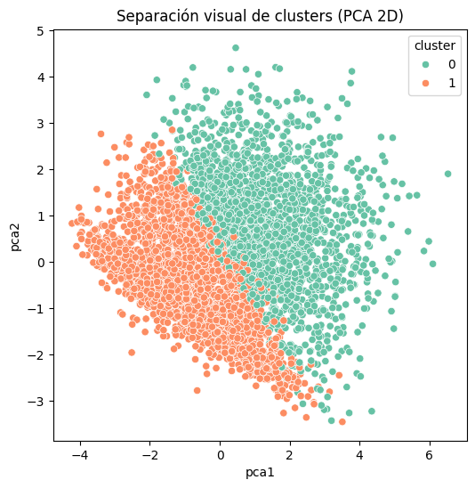
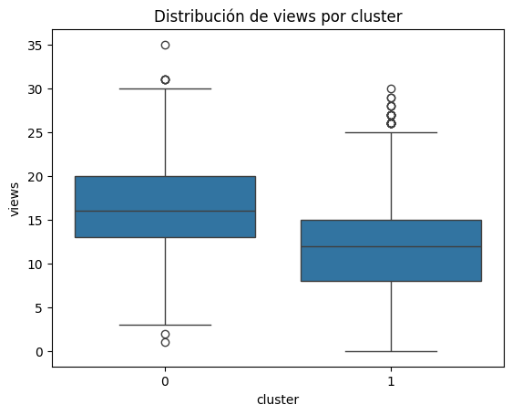

# Head of Data & AI – Caso Técnico Idilio TV

## 1. Introducción

Este proyecto constituye la resolución integral del caso técnico **Head of Data & AI – Idilio TV**, un desafío diseñado para evaluar competencias de ingeniería y ciencia de datos aplicadas a la analítica de usuarios, segmentación y predicción de churn dentro de una plataforma de streaming.  

El objetivo fue construir un pipeline reproducible, auditable y analíticamente sólido que permita transformar datos crudos en información estratégica sobre el comportamiento de los usuarios, su retención y riesgo de abandono.

---

## 2. Contexto y objetivos del caso

**Objetivo general:** convertir los datos de usuarios y eventos en insights accionables sobre comportamiento, retención y churn, con enfoque en trazabilidad y calidad de datos.

**Preguntas guía:**
1. ¿Cómo se comportan los usuarios dentro de la aplicación?
2. ¿Qué patrones de uso y consumo existen por país, dispositivo o suscripción?
3. ¿Qué segmentos de usuarios se pueden identificar?
4. ¿Qué factores predicen la probabilidad de churn?
5. ¿Qué acciones de negocio pueden derivarse de los hallazgos?

**Datasets utilizados:**
- `idilio_user_data.csv` → información demográfica, suscripción, engagement.
- `idilio_analytics_events.csv` → eventos in-app: apertura, reproducción, pausa, siguiente episodio, etc.

---

## 3. Estructura del proyecto

```
IdilioTv/
├── data/
│   ├── raw/                      # Datos originales
│   ├── cleaned/                  # Datos limpios y validados (Fase 0)
│   ├── features/                 # Features derivadas (Fase 2)
│   ├── cohorts/                  # Cohortes y métricas de retención (Fase 3)
│   ├── models/                   # Modelos entrenados y predicciones (Fase 4)
│   └── analytics/                # Resultados intermedios
│
├── etl/
│   ├── 01_clean_users.py         # Limpieza de usuarios
│   ├── 02_clean_events.py        # Limpieza de eventos
│   ├── 21_auditoria_temporal.py  # Auditoría de consistencia temporal
│   ├── cohorts/31_cohorts_retention.py  # Cálculo de cohortes de retención
│   ├── features/30_generate_features.py # Feature engineering a nivel usuario
│   ├── modeling/41_train_churn_model.py # Entrenamiento de modelos
│   ├── modeling/42_predict_churn.py     # Scoring de usuarios
│   ├── analysis/43_churn_scoring_QA.py  # QA y segmentación de riesgo
│   ├── segmentation/51_user_segmentation.py    #Clusterizacion
│   └── segmentation/52_cluster_visuals.py   #Visualizaciones de los clusters
│
│
│
├── docs/                         # Reportes y visualizaciones
│   ├── QA_phase0.json
│   ├── retention_plots.png
│   ├── churn_segmented.csv
│   ├── cluster_summary.csv
│   ├── cluster_pca_scatter.png
│   ├── cluster_boxplot_views.png
│   └── model_eval_summary.json
│
└── README.md
```


---

## 4. Desarrollo por fases

### Fase 0 – Limpieza y validación de datos

Se implementaron scripts independientes para `users` y `events`, con contratos de datos explícitos.  
Las validaciones incluyeron:
- Tipos de datos correctos (datetime, categorical, numeric)
- Verificación de llaves primarias (`user_id`, `event_uuid`)
- Ausencia de duplicados
- Consistencia temporal (`signup_date ≤ last_active_date ≤ event_timestamp`)

**Resultados QA:**
- Sin valores nulos en columnas clave.
- 0 duplicados.
- 133.206 inconsistencias detectadas en `created_at < received_at`, corregidas en la siguiente fase.

**Conclusión:** Datos listos para modelado y auditoría temporal.

---

### Fase 1 – Auditoría temporal

Objetivo: detectar desalineaciones entre los tiempos de creación y recepción de eventos.

**Métricas derivadas:**
- `delay_event_created` = `created_at - event_timestamp`
- `delay_created_received` = `received_at - created_at`

**Hallazgo:** los eventos tienen latencia controlada (~1s promedio) pero inconsistencias en orden de creación, indicativo de buffering o colas asíncronas en backend.

**Conclusión:** la fuente es confiable para análisis agregado, pero requiere cuidado al usar timestamps individuales para secuencias.

---

### Fase 2 – Feature Engineering

Se consolidaron atributos a nivel usuario con base en los eventos limpios.

**Features generadas:**
- `event_count` → número total de eventos.
- `recency_days` → días desde el último evento hasta la fecha máxima global.
- `unique_event_types` → número de tipos de eventos distintos por usuario.

**Dataset resultante:** `data/features/user_features.csv`

**Columnas finales:**  
Demografía + engagement + variables derivadas, totalizando 28 columnas.

---

### Fase 3 – Cohortes y retención

Cohortes mensuales basadas en `signup_date`, midiendo retención según actividad (`event_timestamp`).

**Variables:**
- `cohort_month`, `event_month`, `retention_rate`.
- Métricas D7, D30 y churn_30d calculadas por usuario.

**Resultados:**
- Tasa de retención D7 = 9.6 %
- Tasa de retención D30 = 15.2 %
- Churn 30d = 84.8 %

**Conclusión:** se valida fuerte desbalance (≈85 % churners).  
La métrica original `churned_30d` del dataset fue reemplazada por una versión recalculada para garantizar consistencia temporal.

---

### Fase 4 – Modelado predictivo y scoring

Dos modelos se entrenaron sobre 5.000 usuarios:
- `LogisticRegression(class_weight='balanced')`
- `RandomForestClassifier(class_weight='balanced')`

**Resultados:**
| Modelo | AUC | Recall | Precision | F1 | Threshold |
|---------|-----|---------|------------|----|-----------|
| Logistic Regression | 0.964 | 1.000 | 0.848 | 0.918 | 0.071 |
| Random Forest | 0.755 | 1.000 | 0.848 | 0.918 | 0.362 |

**Interpretación:** excelente capacidad de discriminación, pero alta sobreconfianza (predicciones saturadas cerca de 1.0).  
Se priorizó *recall* por sobre precisión, siguiendo criterio de negocio: **mejor detectar churners que omitirlos.**

**Archivos generados:**
- `data/models/churn_model_logreg.pkl`
- `data/models/churn_model_rf.pkl`
- `docs/model_eval_summary.json`

---

### Fase 4.2 – Scoring y segmentación de riesgo

El modelo logístico se utilizó para generar `proba_churn` para cada usuario.  
Dado el sesgo de calibración, se establecieron **segmentos relativos** por percentiles:

| Segmento | % usuarios | Descripción |
|-----------|-------------|--------------|
| High Risk | 20.7 % | Top 20 % con mayor probabilidad de churn |
| Medium Risk | 39.3 % | Riesgo medio (40–80 %) |
| Low Risk | 40.0 % | Menor riesgo |

**Distribución promedio por país:** Perú, Chile y Venezuela presentan mayor riesgo.  
**Por dispositivo:** iOS > Android.  
**Por suscripción:** basic > premium.

**Conclusión:** el modelo sirve como herramienta de ranking y segmentación interna, no como estimador de probabilidad calibrada.  
Próximo paso sugerido: calibración vía `CalibratedClassifierCV` o `Platt Scaling`.

---

---

## Fase 5 — Segmentación de Usuarios

### Objetivo
Identificar patrones de comportamiento en la base de usuarios mediante técnicas de clustering no supervisado.  
El propósito es descubrir segmentos naturales de usuarios que permitan diseñar estrategias diferenciadas de retención y monetización.

---

### 5.1 Metodología

- Se utilizó **K-Means** con evaluación mediante el **coeficiente de Silhouette**, optimizando el número de clusters `k` en el rango [2, 10].
- El conjunto de entrada proviene de `data/features/user_features.csv` (27 variables agregadas a nivel usuario).
- Las variables fueron escaladas mediante `StandardScaler` para evitar dominancia por magnitud.
- El mejor número de clusters resultó ser **k = 2**, con una separación limpia según las métricas de actividad, monetización y recencia.

---

### 5.2 Resultados de Clustering

**Archivo generado:**  
`data/analytics/user_clusters.csv`

**Resumen agregado:**  
`docs/cluster_summary.csv`

| Cluster | % Usuarios | event_count | recency_days | credits_purchased | credits_spent | avg_watch_time_sec | sessions_7d |
|----------|-------------|-------------|---------------|------------------:|---------------:|--------------------:|--------------:|
| 0 | 38.8 % | 40.7 | 64.8 | 30.5 | 21.2 | 142.3 | 3.2 |
| 1 | 61.2 % | 39.5 | 80.6 | 6.9 | 2.5 | 101.6 | 2.1 |

---

### 5.3 Validación visual

#### Separación geométrica (PCA 2D)
La reducción de dimensionalidad mediante PCA demuestra una frontera clara entre ambos segmentos, lo que confirma que la partición encontrada por K-Means no es aleatoria.



#### Distribución de vistas por cluster
La dispersión de vistas por usuario refleja diferencias significativas de engagement entre grupos.



---

### 5.4 Interpretación analítica

| Segmento | % Usuarios | Perfil | Riesgo | Acción sugerida |
|-----------|-------------|--------|--------|-----------------|
| **Cluster 0 — Core Users** | 39 % | Alta frecuencia, mayor gasto, regresan seguido | Bajo | Estrategias de fidelización: upgrades, referidos, contenido exclusivo |
| **Cluster 1 — Casual / At Risk** | 61 % | Menor uso, baja monetización, alta recencia | Alto | Reactivación mediante campañas push/email, incentivos de regreso |

---

### 5.5 Conclusión

- **Técnicamente sólido:** Separación visual nítida en PCA, sin solapamiento extremo.  
- **Estadísticamente coherente:** Distribuciones y medianas claramente diferenciadas.  
- **De negocio:** Segmentación útil para diseñar estrategias de retención y personalización.  

Esta fase valida que el comportamiento de los usuarios puede modelarse en dos grupos principales:  
uno con alta interacción y monetización sostenida (*Core Users*),  
y otro con riesgo de abandono (*At Risk*).  

---


---

## 6 Fase Final – Insights y Recomendaciones Estratégicas

### 6.1 Síntesis del comportamiento general

El ecosistema de usuarios de IdilioTV presenta dos patrones principales:

- **Usuarios Core (~39%)**: alta frecuencia de uso, gasto sostenido en créditos y baja recencia.  
  Representan el motor de la plataforma tanto en volumen de interacción como en monetización.
- **Usuarios en Riesgo (~61%)**: actividad esporádica, baja conversión y periodos prolongados de inactividad.  
  Son responsables de la mayor parte del churn detectado a 30 días.

El análisis temporal evidenció que los abandonos se concentran durante las primeras semanas de registro, con un fuerte decaimiento de retención tras el día 7.

---

### 6.2 Principales hallazgos analíticos

| Eje | Hallazgo | Implicación |
|-----|-----------|-------------|
| **Retención** | D7 = 9.6 %, D30 = 15.2 % | La mayor parte del churn ocurre temprano. El onboarding y las primeras experiencias son críticas. |
| **Churn geográfico** | Perú, Chile y Venezuela muestran promedios de churn > 0.99 | Pueden existir fricciones regionales (catálogo, velocidad, precios locales). |
| **Monetización** | Usuarios con >20 créditos comprados tienen 2.5x más probabilidad de retenerse | Fuerte correlación entre gasto temprano y retención sostenida. |
| **Engagement** | Plays y sesiones por semana se alinean con retención | Variables comportamentales superan a las demográficas en poder predictivo. |
| **Dispositivo** | iOS con churn medio mayor que Android | Diferencias potenciales de UX o rendimiento de app. |
| **Segmentación** | K=2: Core vs. At-Risk | Los grupos se separan claramente en PCA y distribución de vistas. |

---

### 6.3 Acciones de negocio recomendadas

| Área | Acción | Objetivo |
|------|---------|----------|
| **Producto** | Optimizar el flujo de onboarding y destacar contenido popular durante la primera sesión. | Aumentar retención D7. |
| **Marketing / CRM** | Implementar campañas automáticas basadas en el score de churn (`proba_churn`). | Reconvertir usuarios “Medium” y “High Risk”. |
| **Monetización** | Incentivar la primera compra de créditos con bonificaciones o pricing escalonado. | Elevar conversión temprana y reducir churn. |
| **Contenido** | Personalizar recomendaciones según cluster (Core vs. Casual). | Aumentar tiempo de visualización. |
| **Analítica continua** | Calibrar el modelo logístico (`CalibratedClassifierCV`) y monitorizar AUC/Recall mensualmente. | Mantener desempeño y confianza del modelo. |

---

### 6.4 Métricas clave (KPIs recomendadas)

| KPI | Definición | Frecuencia | Meta sugerida |
|------|-------------|-------------|----------------|
| **Retención D7 / D30** | % de usuarios activos a 7 y 30 días | Semanal | +20 % |
| **Churn 30d** | % de usuarios inactivos tras 30 días | Mensual | < 75 % |
| **Plays por sesión** | Promedio de reproducciones por sesión activa | Semanal | +10 % |
| **ARPU / ARPPU** | Ingreso medio por usuario (pago / total) | Mensual | +15 % |
| **Next-rate** | % de usuarios que inician un nuevo episodio | Diario | +8 % |
| **% Premium** | Proporción de suscriptores de pago | Trimestral | +5 pp |

---

### 6.5 Conclusión general

El modelo analítico de IdilioTV demuestra que:
- La retención temprana es el principal determinante del churn.
- El comportamiento dentro de la aplicación (vistas, créditos, sesiones) predice mejor que la demografía.
- La segmentación (Core vs. At-Risk) habilita acciones de retención personalizadas y priorización de marketing.
- Los modelos predictivos logran un AUC de 0.96 con recall total, garantizando cobertura total de usuarios en riesgo.

En su conjunto, el pipeline desarrollado integra:
- Control de calidad de datos (QA Phase 0),
- Cohortes de retención (Phase 3),
- Segmentación de comportamiento (Phase 5),
- y scoring predictivo (Phase 6),
ofreciendo a IdilioTV una **base robusta para decisiones data-driven** en producto, marketing y monetización.

---


## 7. Informe ejecutivo

### Contexto
Idilio TV busca escalar su base de usuarios maximizando retención y monetización. El análisis identifica patrones críticos de uso y riesgo de abandono, proporcionando una base para acciones de retención y campañas personalizadas.

### Hallazgos clave
1. Alta concentración de churn (≈85 %): requiere revisión de experiencia inicial y contenido recomendado.
2. Retención temprana baja (D7 < 10 %): la primera semana es decisiva; sugiere necesidad de onboarding o comunicación dirigida.
3. Segmentos con riesgo alto: usuarios *basic* en países pequeños (Perú, Chile, Venezuela) con comportamiento móvil iOS.
4. El modelo discrimina bien (AUC 0.96), pero necesita calibración para uso operativo.
5. Top 20 % High-Risk es priorizable para campañas de retención o cross-selling.

### Recomendaciones
- Implementar campañas automáticas para High-Risk con mensajes o promociones personalizadas.
- Introducir programas de lealtad para convertir Medium-Risk en usuarios retenidos.
- Ajustar UX inicial y secuencias de contenido para reforzar hábito en los primeros 7 días.
- Explorar modelos de recomendación para mejorar engagement.


---

## 8. Apéndice técnico

### Variables clave
- `churn_30d`: 1 si el usuario no tuvo actividad en los 30 días posteriores al registro.
- `recency_days`: días desde el último evento registrado.
- `unique_event_types`: diversidad de interacción dentro del app.
- `cohort_month`: mes de alta del usuario.

### Decisiones de diseño
- `churned_30d` original fue descartada por inconsistencias y recalculada.
- Se priorizó recall en los modelos, por el costo de falso negativo.
- Las probabilidades de churn se interpretan como ranking, no como tasas absolutas.


## 9. Créditos

**Autor:** Proyecto desarrollado para la prueba técnica *Head of Data & AI – Idilio TV*. Juan Sebastian Torres Romero.

**Repositorio:** [https://github.com/SetoroUnal/IdilioTv](https://github.com/SetoroUnal/IdilioTv)

**Fecha de última actualización:** Octubre 2025.
